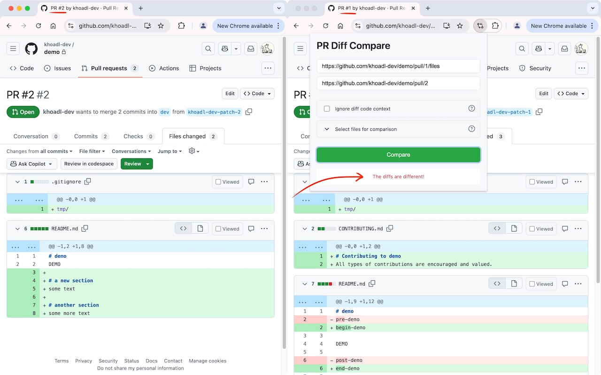
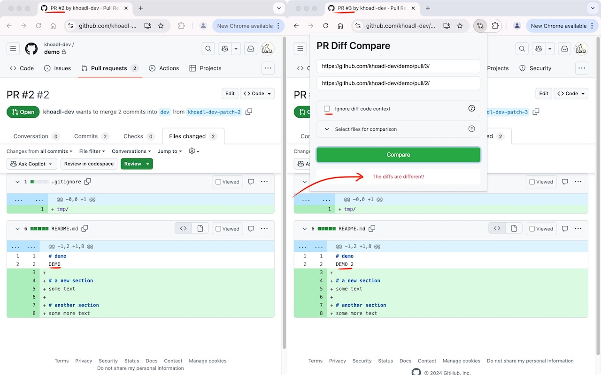
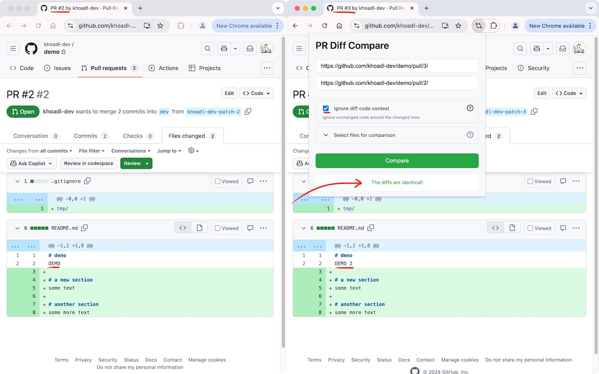
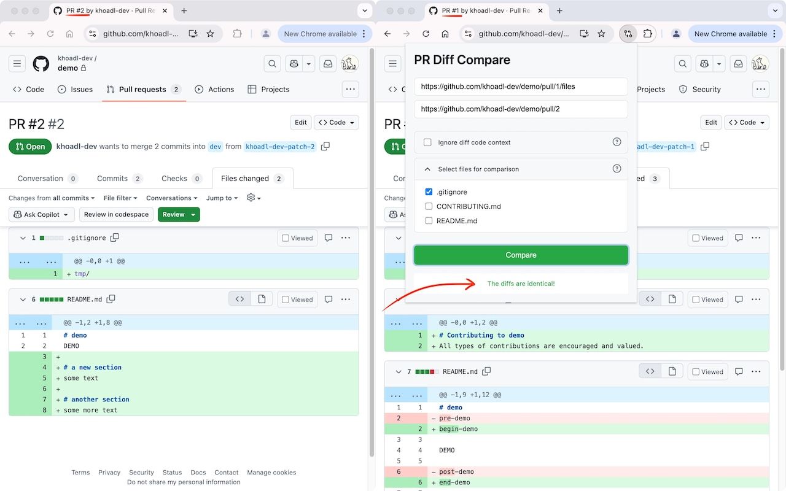
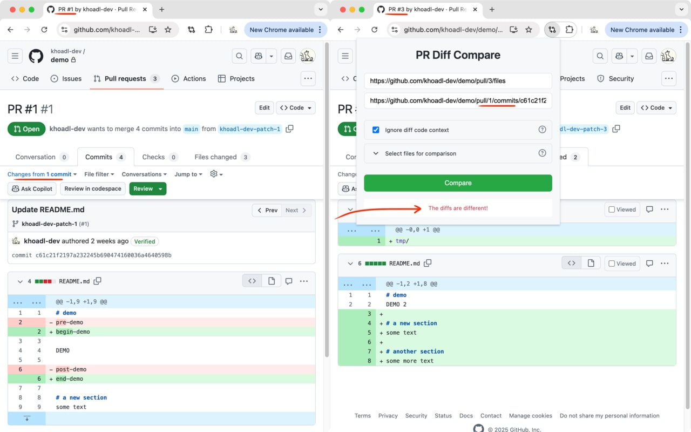
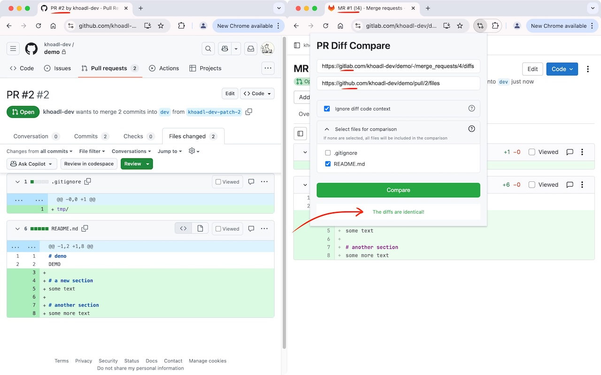

# PR Diff Compare

This is a Chrome extension for comparing 2 PR (Pull Request/Merge Request) diffs. Find it on the Chrome Web Store at https://chromewebstore.google.com/detail/pr-diff-compare/bhboildabfhaebncbooifkkfjninjlnm.

## Why?

This extension can help you compare the diffs of 2 PRs, especially when one is a cherry-pick version of the other. No more silly cherry-pick/merge/rebase mistakes!

## How it works

The tool aims to provide basic [git range-diff](https://git-scm.com/docs/git-range-diff) functionality for Github PRs and Gitlab MRs.
Some good explanations of the Git command can be found in this question [Can somebody explain the usage of git range-diff?](https://stackoverflow.com/a/61219652/14725572)

For now, the tool only outputs whether the diffs are the same or not. It does not show the detailed differences.

## Usage

TL;DR: to compare 2 PRs' diffs, simply open the extension on a PR tab, paste the URL of another PR, and hit Enter.

Step-by-step guide:
1. Open 2 PRs in 2 tabs
2. Copy one of the PR URLs
3. Go to the other PR tab
4. Click the extension icon or use the specified keyboard shortcut to open the popup
5. Paste the URL of the PR you copied in the second input box (the first input box is automatically filled with the current tab's URL)
6. Uncheck the "Ignore diff code context" if you don't want the surrounding (unchanged) code to affect the comparison
7. Click the file dropdown to select the file(s) you want to compare if needed
8. Click "Compare"

**Notes:**

* A PR URL must be in one of the following formats:
  * For Github:
    * PR: `https://github.com/<owner>/<repo>/pull/<pr-number>/<optional-extra-path>`
    * PR commit: `https://github.com/<owner>/<repo>/pull/<pr-number>/commits/<commit-hash>/<optional-extra-path>`
    * Commit: `https://github.com/<owner>/<repo>/commit/<commit-hash>/<optional-extra-path>`
  * For Gitlab:
    * MR: `https://gitlab.com/<owner>/<repo>/-/merge_requests/<mr-number>/<optional-extra-path>`
    * MR commit: `https://gitlab.com/<owner>/<repo>/-/merge_requests/<mr-number>/diffs?commit_id=<commit-hash>`
    * Commit: `https://gitlab.com/<owner>/<repo>/-/commit/<commit-hash>?<optional-query-string>`
* Examples of valid URLs:
  * `https://github.com/owner/repo/pull/1`
  * `https://github.com/owner/repo/pull/2/files`
  * `https://github.com/owner/repo/pull/3/commits/1234567890abcdef`
  * `https://github.com/owner/repo/commit/1234567890abcdef`
  * `https://gitlab.com/owner/repo/-/merge_requests/4`
  * `https://gitlab.com/owner/repo/-/merge_requests/5/diffs?commit_id=1234567890abcdef`
  * `https://gitlab.com/owner/repo/-/commit/1234567890abcdef?merge_request_iid=5`

**Screenshots:**

* 

* 

* 

* 

* 

* 

**Demo video:**

## Data privacy

This extension runs locally and does not collect any of your data.

## TODOs

* [x] Option to run the comparison on specific commit(s)
* [ ] [v2] Showing detailed differences

## Acknowledgements

* This tool is built mainly by Claude 3.5 Sonnet and GPT-4o.
* The extension's favicon is a modified version of the one provided by [Lucide](https://lucide.dev/icons/git-compare-arrows).
